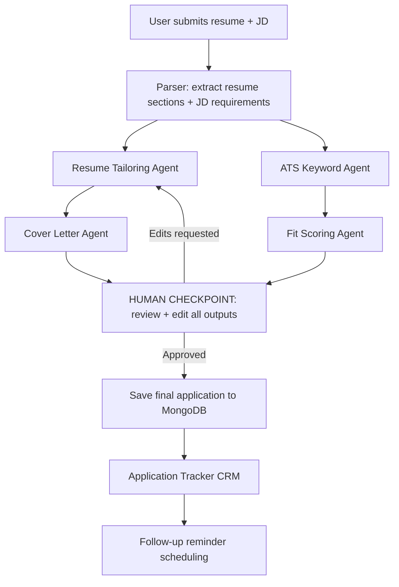

# ApplyForge — Multi-Agent Job Application Copilot

*Paste a job description and your resume — a multi-agent pipeline tailors your application, checks ATS fit, and tracks the whole application lifecycle.*

## Overview

Tailoring every resume and cover letter to each job description is the single most time-consuming part of a job search — and skipping it is exactly what gets freshers filtered out by ATS keyword matching before a human ever sees the resume. Most "AI resume tools" either (a) just rewrite text with no verification of fit, or (b) give a generic ATS score with no actionable fix. None of them close the loop by also tracking what you applied to and when to follow up.

ApplyForge is an agentic pipeline that takes a job description + your resume, produces a tailored resume and cover letter, verifies ATS keyword coverage, scores real fit (not just keyword overlap), and — critically — puts a human approval step before anything is finalized. It then tracks the application through its lifecycle like a lightweight personal CRM.

## Architecture

The system uses a LangGraph-powered AI agent pipeline with a human-in-the-loop checkpoint.

## Setup

(To be added)

## API Reference

(To be added)
