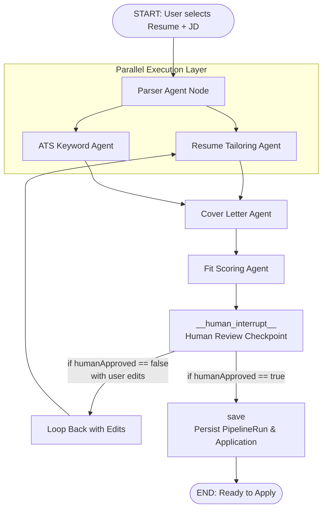
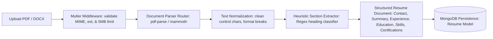
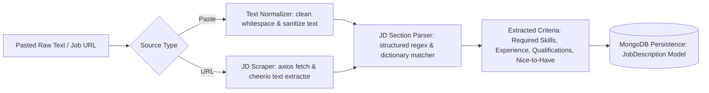
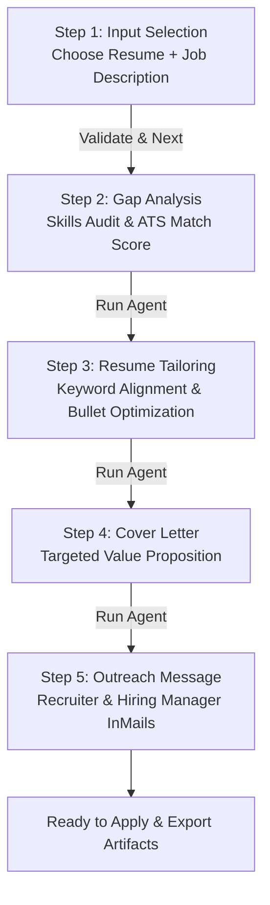
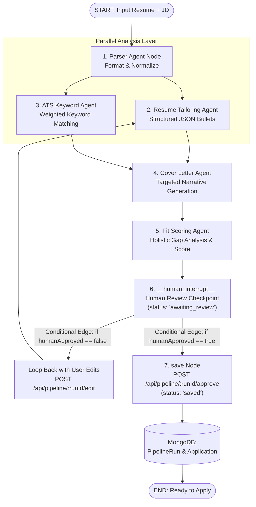

# ApplyForge — Multi-Agent Job Application Copilot

_Paste a job description and your resume — a multi-agent pipeline tailors your application, checks ATS fit, and tracks the whole application lifecycle._

## Overview

Tailoring every resume and cover letter to each job description is the single most time-consuming part of a job search — and skipping it is exactly what gets freshers filtered out by ATS keyword matching before a human ever sees the resume. Most "AI resume tools" either (a) just rewrite text with no verification of fit, or (b) give a generic ATS score with no actionable fix. None of them close the loop by also tracking what you applied to and when to follow up.

ApplyForge is an agentic pipeline that takes a job description + your resume, produces a tailored resume and cover letter, verifies ATS keyword coverage, scores real fit (not just keyword overlap), and — critically — puts a human approval step before anything is finalized. It then tracks the application through its lifecycle like a lightweight personal CRM.

## Architecture

The system uses a LangGraph-powered multi-agent AI pipeline with parallel agent execution and a human-in-the-loop checkpoint before finalization.



## Setup

### Prerequisites

- Node.js (v18 or higher)
- Docker and Docker Compose (for local database)

### Environment Variables

Before starting the app, set up your `.env` files. You can copy the provided example files:

```bash
cp server/.env.example server/.env
```

| Variable            | Description                                    | Default                                |
| ------------------- | ---------------------------------------------- | -------------------------------------- |
| `PORT`              | The port the Express server runs on            | `5000`                                 |
| `NODE_ENV`          | Environment mode (`development`, `production`) | `development`                          |
| `MONGODB_URI`       | Connection string for MongoDB (required later) | `mongodb://localhost:27017/applyforge` |
| `JWT_SECRET`        | Secret key for JWT access tokens               |                                        |
| `ANTHROPIC_API_KEY` | API key for Claude/LangGraph                   |                                        |

### Running the App Locally

**1. Install Dependencies**
Install dependencies for the root, client, and server:

```bash
npm install
npm install -w client
npm install -w server
```

**2. Start the Database**
Use Docker Compose to spin up a local MongoDB instance:

```bash
npm run docker:up
```

**3. Run the Development Servers**
Start both the React frontend and Express backend concurrently:

```bash
npm run dev
```

The frontend will be available at `http://localhost:5173` and the backend API at `http://localhost:5000`.

## API Reference

### Health Check

| Method | Endpoint      | Access | Description                                                                                  |
| ------ | ------------- | ------ | -------------------------------------------------------------------------------------------- |
| `GET`  | `/api/health` | Public | Basic server health check returning `{ status: 'ok', message: 'ApplyForge API is running' }` |

### Authentication Endpoints (`/api/auth`)

| Method | Endpoint             | Access                       | Description                                                                                                                          |
| ------ | -------------------- | ---------------------------- | ------------------------------------------------------------------------------------------------------------------------------------ |
| `POST` | `/api/auth/register` | Public                       | Register a new user with `name`, `email`, and `password`. Returns access token, refresh token, and sanitized user object.            |
| `POST` | `/api/auth/login`    | Public (Rate-limited)        | Authenticate user with credentials. Rate limited to 5 requests per 15 minutes. Returns access token, refresh token, and user object. |
| `GET`  | `/api/auth/me`       | Protected (`Bearer <token>`) | Retrieve current authenticated user profile without sensitive password hashes or tokens.                                             |
| `POST` | `/api/auth/refresh`  | Public                       | Submit `refreshToken` to receive a newly issued `accessToken`.                                                                       |
| `POST` | `/api/auth/logout`   | Protected / Token-based      | Invalidate active session by clearing the stored `refreshToken` in the database.                                                     |

### Resume Ingestion Endpoints (`/api/resumes`)

| Method   | Endpoint           | Access                       | Description                                                                                              |
| -------- | ------------------ | ---------------------------- | -------------------------------------------------------------------------------------------------------- |
| `POST`   | `/api/resumes`     | Protected (`Bearer <token>`) | Upload and parse resume file (PDF or DOCX, up to 5MB). Extracts sections, saves to MongoDB, returns doc. |
| `GET`    | `/api/resumes`     | Protected (`Bearer <token>`) | List all resumes belonging to the authenticated user (`id`, `name`, `uploadedAt`), sorted newest first.  |
| `GET`    | `/api/resumes/:id` | Protected (`Bearer <token>`) | Retrieve full resume document with complete `parsedSections` (Contact, Summary, Experience, etc.).       |
| `DELETE` | `/api/resumes/:id` | Protected (`Bearer <token>`) | Delete resume with user ownership verification and associated file cleanup on disk.                      |

### Job Description Endpoints (`/api/jds`)

| Method   | Endpoint            | Access                       | Description                                                                                          |
| -------- | ------------------- | ---------------------------- | ---------------------------------------------------------------------------------------------------- |
| `POST`   | `/api/jds`          | Protected (`Bearer <token>`) | Create and parse a new job description from pasted text (`company`, `roleTitle`, `rawText`).         |
| `POST`   | `/api/jds/from-url` | Protected (`Bearer <token>`) | Scrape and ingest job description from target URL (stretch preview stub, responds `501`).           |
| `GET`    | `/api/jds`          | Protected (`Bearer <token>`) | List all job descriptions for the authenticated user, sorted in reverse chronological order.         |
| `GET`    | `/api/jds/:id`      | Protected (`Bearer <token>`) | Retrieve full job description document with complete `parsedRequirements` and original `rawText`.   |
| `DELETE` | `/api/jds/:id`      | Protected (`Bearer <token>`) | Delete job description with user ownership verification.                                             |

### Pipeline Endpoints (`/api/pipeline`)

| Method | Endpoint                    | Access                       | Description                                                                                                                                   |
| ------ | --------------------------- | ---------------------------- | --------------------------------------------------------------------------------------------------------------------------------------------- |
| `POST` | `/api/pipeline/run`         | Protected (`Bearer <token>`) | Starts the multi-agent pipeline with `resumeId` and `jdId`. Executes up to `__human_interrupt__` and returns `{ runId, state, status: 'awaiting_review' }`. |
| `GET`  | `/api/pipeline/:runId`      | Protected (`Bearer <token>`) | Retrieves current state and status for a pipeline run.                                                                                        |
| `POST` | `/api/pipeline/:runId/approve` | Protected (`Bearer <token>`) | Resumes graph execution with human approval. Transitions to `save` node, marks status `'saved'`, and links/persists `Application`.           |
| `POST` | `/api/pipeline/:runId/edit`    | Protected (`Bearer <token>`) | Resumes graph execution with candidate edits (`userEdits`). Loops back to `resume_tailoring` with edits applied and re-halts at `awaiting_review`. |


## Resume Ingestion & Parsing Pipeline


ApplyForge features a robust, heuristic document ingestion pipeline that transforms unstructured PDF and DOCX resumes into structured, schema-compliant career profiles ready for AI tailoring.

### Ingestion Lifecycle



### Supported Formats & Limits

| Format                      | File Extension | MIME Type                                                                 | Max File Size | Parser Engine |
| --------------------------- | -------------- | ------------------------------------------------------------------------- | ------------- | ------------- |
| **Portable Document**       | `.pdf`         | `application/pdf`                                                         | `5 MB`        | `pdf-parse`   |
| **Microsoft Word Document** | `.docx`        | `application/vnd.openxmlformats-officedocument.wordprocessingml.document` | `5 MB`        | `mammoth`     |

### Extracted Resume Sections

- **Contact**: Candidate name, email address, phone number, physical location, LinkedIn profile, GitHub profile, and portfolio website.
- **Summary**: Professional summary and executive profile statements.
- **Experience**: Work history timeline including job titles, companies, employment dates (`startDate`, `endDate`, `current`), locations, descriptions, and itemized bullet points.
- **Education**: Academic history including universities/institutions, degrees, fields of study, attendance dates, GPA, and honors.
- **Skills**: Technical skills, frameworks, tools, and competencies extracted via dictionary matching and delimited tokens.
- **Certifications**: Industry credentials, issuers, credential dates, and verification URLs.

### Resume UI Components

- **`ResumeUploader`** (`client/src/components/resume/ResumeUploader.jsx`):
  - Interactive drag-and-drop zone with visual hover/drop animations.
  - File picker with client-side format and size validation.
  - Real-time animated upload progress bar and parsing state indicator.
  - Uploaded resumes management list with selection and inline delete confirmation.
- **`ResumePreview`** (`client/src/components/resume/ResumePreview.jsx`):
  - Structured card layout rendering contact pills, professional summary, skill tags, work experience timeline with bullet points, education, and certifications.
  - Raw extracted text view with one-click copy to clipboard for transparency.

## Job Description (JD) Ingestion & Parsing Pipeline

ApplyForge provides an intelligent job description ingestion and parsing pipeline that processes pasted job listings or URLs, extracting essential job criteria, required skills, and qualification metrics through structured regex heuristics and keyword classification.

### JD Ingestion Lifecycle



### Extracted JD Criteria & Heuristics

- **Required Skills**: Core technical competencies, programming languages, platforms, and frameworks matched against a comprehensive technology dictionary.
- **Experience Years**: Numeric year ranges, seniority levels (Junior, Mid-Level, Senior, Staff, Lead), and minimum required experience detected via regex heuristics.
- **Qualifications**: Degrees (Bachelor's, Master's, PhD), certifications, and relevant academic or professional prerequisites.
- **Nice-to-Have**: Preferred skills, bonus domain experience, and optional competencies separated from non-negotiable requirements.

### JD UI Components

- **`JDPasteForm`** (`client/src/components/jd/JDPasteForm.jsx`):
  - Company name and role title inputs with clean dark-mode input fields.
  - Large expandable textarea for job postings with real-time character count and paste actions.
  - Quick example loader for rapid testing and interactive validation.
- **`JDRequirementsPanel`** (`client/src/components/jd/JDRequirementsPanel.jsx`):
  - Color-coded tag lists displaying extracted required skills, qualifications, experience level, and nice-to-have items.
  - Summary metrics and expandable full text preview with one-click clipboard copy.

## Application Tailoring Wizard Flow

The multi-step Application Copilot wizard orchestrates user inputs, LLM multi-agent reasoning, and generated artifacts through centralized Redux state management.

### Wizard Lifecycle Diagram



### Wizard Architecture & State Management

1. **Redux Store Slice (`client/src/store/applySlice.js`)**:
   - **Step Tracking**: `currentStep` (1 to 5) with sequential boundary navigation (`setCurrentStep`, `nextStep`, `prevStep`).
   - **Document Selection**: `selectedResume` and `selectedJd` instances linked to persistent MongoDB documents.
   - **Agent Outputs**: Central store holding `status` (`idle`, `loading`, `succeeded`, `failed`), `gapAnalysis`, `tailoredResume`, `coverLetter`, `outreachMessage`, and execution timestamps.
   - **Typed Selectors**: Memoized selectors (`selectCurrentStep`, `selectIsStep1Ready`, `selectAgentOutputs`) ensuring optimized re-renders.

2. **Visual Step Indicator (`client/src/components/ui/StepIndicator.jsx`)**:
   - Interactive animated progress rail highlighting active, completed, and upcoming steps.
   - Icon badges and numbered state transitions with accessible ARIA attributes.

## Multi-Agent Copilot Pipeline Architecture (LangGraph)

ApplyForge coordinates a graph of specialized, cooperative AI agents powered by **LangChain**, **LangGraph**, and **Google Gemini** (`gemini-2.5-flash`). The pipeline combines parallel fan-out analysis with sequential synthesis and a human approval safety checkpoint.

### Detailed Graph Topology & State Flow



### Agent Nodes Breakdown

1. **Parser Agent Node (`server/src/agents/nodes/parserNode.js`)**:
   - Normalizes unstructured parsed sections from PDF/DOCX resumes into `structuredResume` (deduplicated skills, clean contact, sorted experience, normalized education/certifications).
   - Normalizes parsed JD requirements into `structuredJD` (required skills, nice-to-have, experience, qualifications).
   - Generates quick comparison metrics (`initialMatchRatio`, `matchedSkills`, `missingSkills`).

2. **Resume Tailoring Agent Node (`server/src/agents/nodes/resumeTailoringNode.js`)**:
   - System prompt mandates zero fabrication, authentic voice preservation, and targeted keyword reinforcement.
   - Outputs structured JSON array: `[{ originalBullet, tailoredBullet, reasoning }]`.
   - Incorporates candidate `userEdits` instructions dynamically on revision cycles.

3. **ATS Keyword Agent Node (`server/src/agents/nodes/atsKeywordNode.js`)**:
   - Categorizes JD keywords into importance tiers: `required` (weight: 3), `preferred` (weight: 2), and `bonus` (weight: 1).
   - Analyzes presence across resume sections (Skills, Experience, Summary, Education, Certifications, Tailored Bullets).
   - Outputs `{ matchedKeywords, missingKeywords, overallScore }` with actionable suggestions for missing keywords.

4. **Cover Letter Agent Node (`server/src/agents/nodes/coverLetterNode.js`)**:
   - Generates a bespoke, role-specific cover letter weaving in the candidate's tailored bullet accomplishments.
   - Strictly prohibits generic AI clichés ("I am writing to apply", "perfect fit", "hard worker", "out-of-the-box thinker").
   - Outputs structured JSON: `{ subject, body, keyThemes }`.

5. **Fit Scoring Agent Node (`server/src/agents/nodes/fitScoringNode.js`)**:
   - Synthesizes quantitative ATS metrics (60%) with qualitative depth and seniority evaluation (40%).
   - Classifies compatibility tier:
     - `80 - 100`: `'strong'`
     - `60 - 79`: `'moderate'`
     - `0 - 59`: `'stretch'`
   - Produces itemized gaps with severity (`high`, `medium`, `low`) and concrete suggestions.
   - Highlights 2-5 standout candidate strengths.

6. **Human-in-the-Loop Checkpoint (`__human_interrupt__`)**:
   - LangGraph pauses execution right after fit scoring via `interruptBefore: ['__human_interrupt__']`.
   - State and thread are checkpointed with `MemorySaver`.
   - Halts at `status: 'awaiting_review'` for candidate inspection and decision.

7. **Persistence & Lifecycle (`PipelineRun` & `Application` Models)**:
   - **`PipelineRun` Model** (`server/src/models/PipelineRun.js`): Persists full intermediate and final state, status, and telemetry.
   - **`Application` Model** (`server/src/models/Application.js`): Stores final tailored application linked to the originating `pipelineRunId` and `runId`.

## Frontend Authentication Flow

The client application implements a complete, modern authentication system built with React 19, React Router, React Hook Form, Zod, and Tailwind CSS.

### Architecture & Lifecycle

1. **Route Protection & Guards**:
   - **`PublicRoute`**: Wraps guest-only routes (`/login`, `/register`). If an authenticated user visits these routes, they are automatically redirected to `/dashboard`.
   - **`PrivateRoute`**: Protects workspace routes (`/dashboard`, `/apply`, `/tracker`). If a visitor lacks a valid token, they are redirected to `/login`.
   - **`PageLoader`**: Displays an ambient, brand-styled spinner screen during initial session verification.

2. **State Management (`AuthContext`)**:
   - Manages `user`, `accessToken`, and `loading` states.
   - Exposes asynchronous actions: `login(email, password)`, `register(name, email, password)`, and `logout()`.
   - Synchronizes token persistence in memory and `localStorage`.

3. **HTTP Interceptors (`client/src/lib/axios.js`)**:
   - **Request Interceptor**: Automatically attaches `Authorization: Bearer <token>` to all outgoing API requests.
   - **Response Interceptor**: Automatically intercepts `401 Unauthorized` responses, queues incoming requests, exchanges the stored `refreshToken` for a new `accessToken` via `POST /api/auth/refresh`, and transparently replays the original requests without user disruption. If refresh fails, it clears credentials and triggers logout.

4. **Notifications & Feedback (`useToast`)**:
   - Custom hook wrapper around `react-hot-toast` with theme presets matching the dark palette (`slate-900`, `slate-800`, emerald success, and rose error states).

5. **Layout Wrapper (`AppLayout`)**:
   - Wraps protected pages with a responsive sticky top `Navbar` (brand monogram, links, user badge, mobile hamburger drawer) and a desktop navigation sidebar (Dashboard, Tailor Application, Tracker, Multi-Agent status indicator, and quick logout button).

### Screenshots

<!-- Screenshot Placeholders -->

| Page          | Preview                                                                                                                                                                                                                                                                                    |
| ------------- | ------------------------------------------------------------------------------------------------------------------------------------------------------------------------------------------------------------------------------------------------------------------------------------------ |
| **Login**     | _<!-- Screenshot Placeholder: docs/screenshots/login.png -->_<br><br>_Dark-mode login form with validation and error shake animation_      |
| **Register**  | _<!-- Screenshot Placeholder: docs/screenshots/register.png -->_<br><br>_Real-time password length indicator and Zod validation_ |
| **Dashboard** | _<!-- Screenshot Placeholder: docs/screenshots/dashboard.png -->_<br><br>_AppLayout with sidebar, Navbar, and application metrics_ |

### Testing & Verification Suites

Run the backend test suites to verify system functionality:

```bash
# Authentication flow E2E smoke test
npm run test:auth -w server

# Resume model schema and validations
npm run test:resume -w server

# Multer file upload middleware (type validation, size limits)
npm run test:upload -w server

# PDF parser service
npm run test:pdf -w server

# DOCX parser service
npm run test:docx -w server

# Heuristic resume section extractor
npm run test:section -w server

# Resume upload endpoint (POST /api/resumes)
npm run test:upload-endpoint -w server

# Resume list and detail endpoints (GET /api/resumes)
npm run test:get-resumes -w server

# Resume delete endpoint with ownership guard (DELETE /api/resumes/:id)
npm run test:delete-resume -w server

# JobDescription model schema and validation
npm run test:jd-model -w server

# Job description section parser service
npm run test:jd-parser -w server

# Job description creation endpoint (POST /api/jds)
npm run test:create-jd -w server

# JD scraper service & URL ingestion endpoint (POST /api/jds/from-url)
npm run test:jd-scraper -w server

# JD list, detail, and delete endpoints (GET/DELETE /api/jds)
npm run test:jd-crud -w server

# LangChain + LangGraph + Gemini setup
npm run test:llm -w server

# LangGraph Agent State Schema
npm run test:agent-state -w server

# Parser Agent Node
npm run test:parser-node -w server

# Resume Tailoring Agent Node
npm run test:resume-tailoring -w server

# ATS Keyword Agent Node
npm run test:ats-keyword -w server

# Cover Letter Agent Node
npm run test:cover-letter -w server

# Fit Scoring Agent Node
npm run test:fit-scoring -w server

# LangGraph Pipeline Assembly & Topology
npm run test:pipeline -w server

# Pipeline API Endpoints (run, status, edit, approve)
npm run test:pipeline-endpoints -w server

# PipelineRun & Application Models Persistence
npm run test:pipeline-run-model -w server
```


