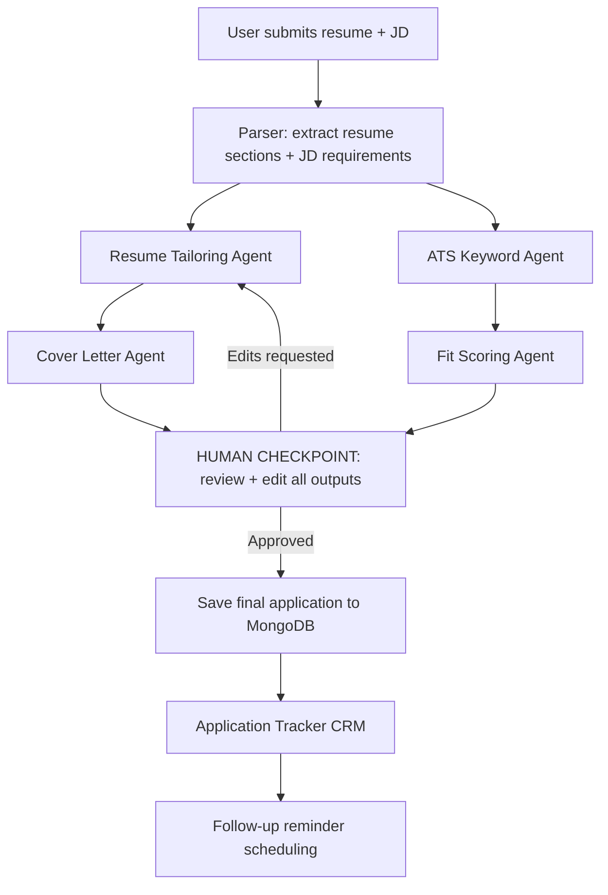

# ApplyForge — Multi-Agent Job Application Copilot

*Paste a job description and your resume — a multi-agent pipeline tailors your application, checks ATS fit, and tracks the whole application lifecycle.*

## Overview

Tailoring every resume and cover letter to each job description is the single most time-consuming part of a job search — and skipping it is exactly what gets freshers filtered out by ATS keyword matching before a human ever sees the resume. Most "AI resume tools" either (a) just rewrite text with no verification of fit, or (b) give a generic ATS score with no actionable fix. None of them close the loop by also tracking what you applied to and when to follow up.

ApplyForge is an agentic pipeline that takes a job description + your resume, produces a tailored resume and cover letter, verifies ATS keyword coverage, scores real fit (not just keyword overlap), and — critically — puts a human approval step before anything is finalized. It then tracks the application through its lifecycle like a lightweight personal CRM.

## Architecture

The system uses a LangGraph-powered AI agent pipeline with a human-in-the-loop checkpoint.



## Setup

### Prerequisites
- Node.js (v18 or higher)
- Docker and Docker Compose (for local database)

### Environment Variables

Before starting the app, set up your `.env` files. You can copy the provided example files:

```bash
cp server/.env.example server/.env
```

| Variable | Description | Default |
| -------- | ----------- | ------- |
| `PORT` | The port the Express server runs on | `5000` |
| `NODE_ENV` | Environment mode (`development`, `production`) | `development` |
| `MONGODB_URI` | Connection string for MongoDB (required later) | `mongodb://localhost:27017/applyforge` |
| `JWT_SECRET` | Secret key for JWT access tokens | |
| `ANTHROPIC_API_KEY`| API key for Claude/LangGraph | |

### Running the App Locally

**1. Install Dependencies**
Install dependencies for the root, client, and server:
```bash
npm install
npm install -w client
npm install -w server
```

**2. Start the Database**
Use Docker Compose to spin up a local MongoDB instance:
```bash
npm run docker:up
```

**3. Run the Development Servers**
Start both the React frontend and Express backend concurrently:
```bash
npm run dev
```

The frontend will be available at `http://localhost:5173` and the backend API at `http://localhost:5000`.

## API Reference

(To be added)
